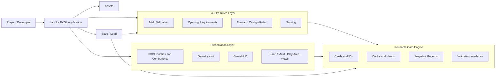
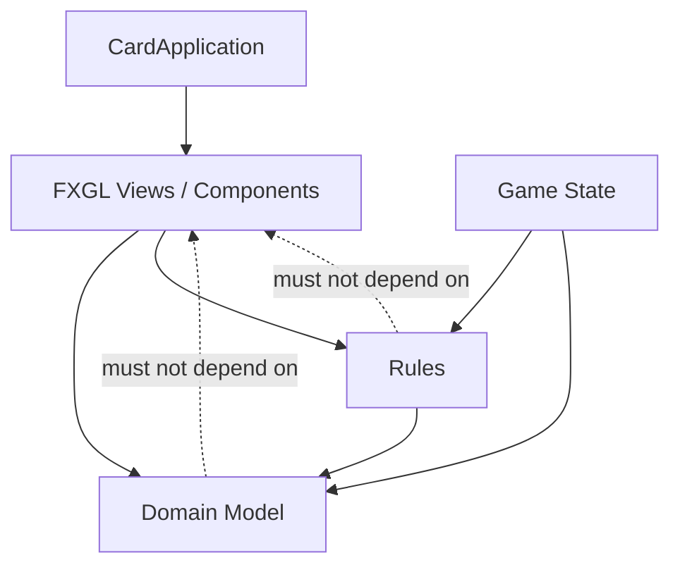
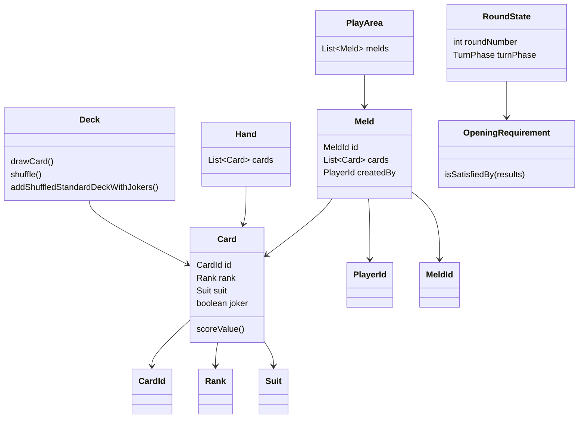
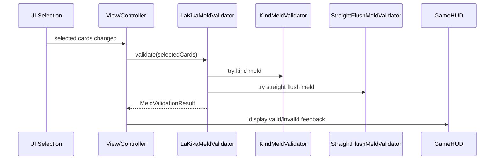
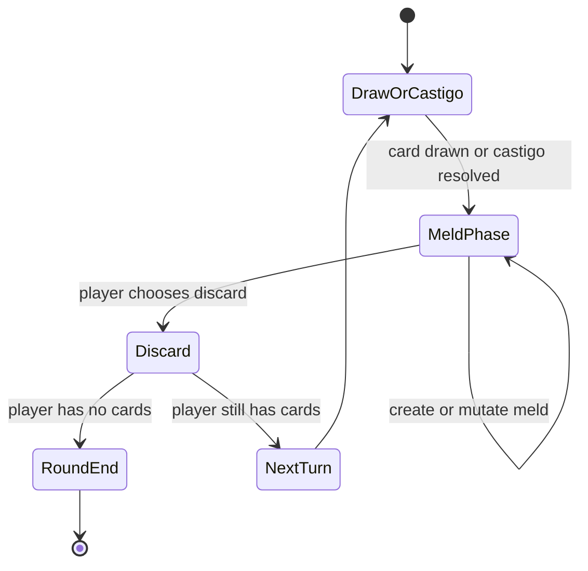
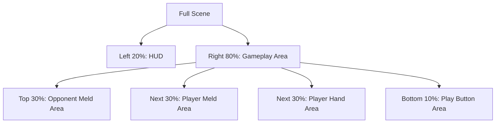
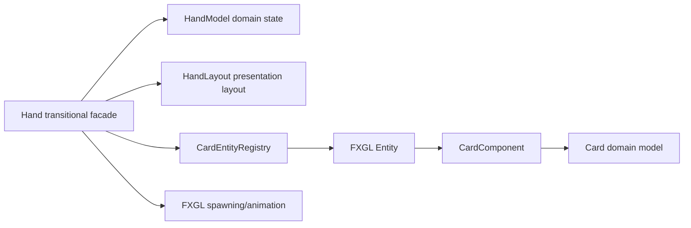

# Architecture Overview

This document explains the large-scale design of the La Kika project. It is meant to help Raul keep the architecture in view while the codebase grows.

The other project documents answer detailed product and rule questions. This document answers a different question:

> How should the parts of the system fit together?

## What This Kind of Document Is Called

Common software-development names for this kind of artifact include:

- Architecture overview
- System architecture document
- Software architecture document
- C4 model documentation
- Component diagram
- Module diagram
- Package architecture

For this project, the most useful format is:

> Architecture overview + Mermaid diagrams + short explanations.

The C4 model is especially useful because it lets us describe the system at different zoom levels:

1. Context: what the system is and who uses it.
2. Container: major applications/libraries/modules.
3. Component: important internal parts.
4. Code: classes, interfaces, and detailed relationships.

We do not need a heavy enterprise architecture document. We need a living map.

## Current Architectural Goal

The goal is to build:

```text
A reusable card-game engine
+
A specific FXGL application for La Kika
```

This means the architecture should move toward this dependency direction:

```text
FXGL Application -> La Kika Rules -> Card Engine
```

The reverse should not happen.

Bad direction:

```text
Card Engine -> FXGL
```

Good direction:

```text
FXGL code depends on domain code.
Domain code does not depend on FXGL.
```

## High-Level Architecture



## Layers

### 1. Engine Layer

The engine layer should contain reusable concepts that are not specific to JavaFX, FXGL, or the La Kika UI.

Current and near-future examples:

```text
Card
CardId
CardSnapshot
Rank
Suit
Deck
CardCollection
MeldValidator interface
Validation result types
Snapshot types
```

The engine layer should be easy to unit test.

It should not know about:

```text
FXGL Entity
Texture
Animation
Mouse input
HUD
Scene layout
```

### 2. La Kika Rules Layer

This layer contains rules specific to La Kika.

Examples:

```text
LaKikaMeldValidator
KindMeldValidator
StraightFlushMeldValidator
JokerRules
OpeningRequirements
Castigo rules
Round rules
Scoring rules
```

This layer should also be testable without launching FXGL.

### 3. Application State Layer

This layer coordinates an actual running game.

Future examples:

```text
GameState
RoundState
TurnState
PlayerState
PlayArea
Move handling
LegalMoveValidator
```

This layer knows what phase the game is in and decides whether an otherwise valid action is currently legal.

Important distinction:

```text
Meld validation = Is this card group structurally valid?
Move legality = May this player do this action right now?
```

### 4. Presentation Layer

This layer handles what the player sees and interacts with.

Examples:

```text
CardComponent
CardAnimationComponent
GameHUD
GameLayout
HandView
MeldView
PlayAreaView
```

This layer may depend on FXGL and JavaFX.

It should ask the domain/application layer questions instead of implementing rules directly.

### 5. Asset Layer

This includes sprites, textures, icons, and visual resources.

Examples:

```text
deck.png
card-backs-enhancers-seals.png
joker.png
icon.png
```

Assets are presentation concerns, not domain concerns.

## Current Module Map

The project currently lives mostly under one package:

```text
quetzal.cards
```

That is acceptable during prototyping, but the conceptual architecture is already larger than one package.

A future package structure may look like this:

```text
quetzal.cards.engine.model
quetzal.cards.engine.collection
quetzal.cards.engine.validation
quetzal.cards.engine.snapshot

quetzal.cards.lakika.rules
quetzal.cards.lakika.state
quetzal.cards.lakika.move
quetzal.cards.lakika.scoring

quetzal.cards.fxgl.component
quetzal.cards.fxgl.view
quetzal.cards.fxgl.layout
quetzal.cards.fxgl.hud

quetzal.cards.app
```

Do not rush this package split. The boundaries should become clear first.

## Dependency Rule

Use this rule to catch architectural mistakes:

> Dependencies should point inward toward stable domain concepts, not outward toward UI or framework code.



If `Card`, `Deck`, `Meld`, `Move`, `RoundState`, or validators import FXGL, that is a warning sign.

## Current Milestone Architecture

### Completed: Milestone 1 - Card and Deck Foundation

The project now has a cleaner card foundation:

```text
CardId = stable physical identity
Card = rank/suit/joker + ID
CardSnapshot = save-state representation
Deck = creates standard cards and jokers
Rank = sequence value + score value
Suit = standard suits
```

Key architectural decision:

```text
Card does not own an FXGL Entity.
```

### Completed: Milestone 2 - Domain Nouns and Interfaces

The project now has domain vocabulary in code:

```text
Meld
MeldId
MeldType
MeldPlacement
Move
MoveResult
PlayArea
RoundState
OpeningRequirement
TurnPhase
StolenJokerObligation
```

Key architectural decision:

```text
Opening is a state transition, not a special player action.
```

### Completed: Milestone 3 - Meld Validation

The project now has La Kika meld validation:

```text
LaKikaMeldValidator
KindMeldValidator
StraightFlushMeldValidator
JokerRules
MeldValidationResult
MeldValidationError
MeldInterpretation
JokerAssignment
```

Key architectural decision:

```text
Joker meaning is computed during validation and returned in the validation result.
```

## Deep Modules

A deep module has a small public interface and hides substantial complexity behind that interface.

A shallow module has an interface that exposes too much of its internal complexity. Shallow modules often force the caller to understand implementation details.

### Your Understanding

Your understanding is close, but I would adjust it slightly.

Deep modules are not primarily about being large modules or grouping many fine-grained modules together. They are about the ratio between:

```text
simple interface
large hidden implementation value
```

A deep module can internally contain many small classes. That is fine. The important part is that callers interact with a simple surface.

A shallow module may also be small, but the problem is that it does not hide much complexity.

## Deep vs Shallow Example: Meld Validation

### Shallow Design

```java
boolean hasAtLeastThreeCards(List<Card> cards);
boolean hasTooManyJokers(List<Card> cards);
boolean hasMixedRanks(List<Card> cards);
boolean hasMixedSuits(List<Card> cards);
boolean hasDuplicateSequenceRanks(List<Card> cards);
boolean hasConsecutiveJokers(List<Card> cards);
List<JokerAssignment> inferJokers(List<Card> cards);
MeldType inferType(List<Card> cards);
```

This looks fine-grained, but it is shallow if the caller must orchestrate everything.

The caller has to know:

- Which checks run first.
- Which checks apply to kind melds.
- Which checks apply to straight flushes.
- How joker ratio interacts with other rules.
- How errors should be combined.
- How to infer joker assignments.

That makes the caller responsible for the rule system.

### Deep Design

```java
MeldValidationResult result = meldValidator.validate(cards);
```

Behind that one method, the validator can use many internal helpers:

```text
KindMeldValidator
StraightFlushMeldValidator
JokerRules
SequenceAnalyzer
ErrorCollector
```

The caller does not need to know the internal steps.

This is a deep module.

## Deep Module Example: Future Turn Engine

A shallow turn design would look like this:

```java
if (turnPhase == DRAW) { ... }
if (playerHasOpened(player)) { ... }
if (jokerObligationExists(player)) { ... }
if (discardIsAllowed(player)) { ... }
moveCardsBetweenCollections(...)
updateRoundState(...)
updateHUD(...)
```

This spreads rules everywhere.

A deeper design would look like this:

```java
MoveResult result = game.playMove(playerId, move);
```

or:

```java
TurnResult result = turnService.apply(action);
```

The implementation can internally check:

- Current turn phase.
- Whether the player has opened.
- Whether the move is structurally valid.
- Whether the move is legal now.
- Whether stolen joker obligations are satisfied.
- Whether the round has ended.
- What events should be emitted for the UI.

The interface stays simple.

## Deep Module Example: Presentation

A shallow UI design would make domain objects know about coordinates:

```java
card.setEntity(entity);
card.animateTo(GameLayout.PLAYER_MELD_X, GameLayout.PLAYER_MELD_Y);
```

That is bad because `Card` now knows presentation details.

A deeper presentation design would look like:

```java
playAreaView.showMeldCreated(meldId, cards);
```

or:

```java
animationService.animateCardsToRegion(cards, LayoutRegion.PLAYER_MELDS);
```

The caller does not need to know exact coordinates or animation details.

## Architecture Style for This Project

The emerging style is:

```text
Domain model + rules engine + FXGL presentation adapter
```

This is close to ideas from:

- Layered architecture
- Clean architecture
- Hexagonal architecture
- Domain-driven design
- C4 architecture documentation

We do not need to be dogmatic about any one named architecture. The useful rule is:

> Keep game rules testable and independent from rendering.

## Suggested Living Diagrams

This project should maintain a few text-based diagrams.

### 1. Layer Diagram

Shows dependency direction.

### 2. Domain Model Diagram

Shows important game concepts:

```text
Game, Round, Turn, Player, Hand, Meld, PlayArea, Deck, DiscardPile
```

### 3. Validation Flow Diagram

Shows how selected cards become a validation result.

### 4. Turn Flow Diagram

Shows draw/castigo, play/mutate, discard.

### 5. UI Layout Diagram

Shows HUD, meld areas, hand area, buttons.

## Domain Model Sketch



## Meld Validation Flow



## Turn Flow Sketch



## UI Layout Sketch



## How to Use This Document While Coding

Before adding a class, ask:

1. Is this domain, rules, state, presentation, or asset code?
2. Should this class depend on FXGL?
3. Is this class exposing a simple interface or leaking implementation details?
4. Is this rule already represented in a named domain concept?
5. Can this be unit tested without launching the game?

If the answer is unclear, stop and update the architecture before coding.

## Near-Term Architecture Risks

### Risk 1: `Hand` still does too much

`Hand` still mixes domain, selection, entity mapping, animation, and layout concerns.

This is scheduled for Milestone 4.

### Risk 2: UI feedback may know too much about rules

The HUD should display validation results, not implement validation logic.

### Risk 3: Turn legality is not implemented yet

Meld validation only tells us whether a group of cards can form a meld. It does not tell us whether the current player may play it right now.

### Risk 4: Save/load is only partially designed

`CardSnapshot` exists, but full game snapshots do not yet exist.

### Risk 5: Package boundaries are still informal

Everything is still close together in `quetzal.cards`. That is acceptable for now, but the conceptual boundaries should guide future package refactoring.

## Current Recommended Next Step

Before Milestone 4, review whether Milestone 3 validation feels correct in the running application.

Then proceed to Milestone 4:

```text
Split Hand domain logic from FXGL presentation behavior.
```

Milestone 4 is where the architecture will become visibly cleaner because it will separate:

```text
What the hand is
from
How the hand is displayed and animated
```


## Presentation Architecture Decisions

### Hot-Seat Visibility

The application prototype uses local hot-seat play.

Normal gameplay should show only the active player's hand. Hidden hands may be shown through a debug overlay during development.

Long-term, a pass-device screen should be introduced between turns.

### Straight Flush Ordering Boundary

Straight flush ordering is a good example of a domain/presentation boundary.

The validator answers:

```text
Can these cards structurally form a straight flush?
```

The presentation layer answers:

```text
How should these cards be arranged visually once played?
```

Current decision:

- Players may select straight-flush cards in any order.
- Played straight flush melds display in normalized sequence order.
- Kind melds preserve selected/insertion order.

### Castigo State Boundary

The castigo limit is not a meld-validation concern.

It belongs to player/game state and turn legality.

Current rule:

- Each player has 10 castigos per game.
- Castigos reset between games, not rounds.
- Only taking a castigo consumes one.

## Milestone 4A Implementation Note

Milestone 4A begins the presentation architecture split without attempting a full UI redesign.

### New Boundary

The old `Hand` class mixed several responsibilities:

```text
card collection
selection state
selectability state
FXGL entity mapping
hand layout math
card spawning
card animation
played-card placement
```

Milestone 4A introduces three helper modules:

```text
HandModel           // pure hand state: cards, selected cards, selectability
HandLayout          // hand card spacing/centering/selected-card offset math
CardEntityRegistry  // presentation-layer CardId -> FXGL Entity mapping
```

The existing `Hand` class remains as a transitional facade so the rest of the prototype continues to run.

### Current Dependency Direction



This is not the final architecture, but it is a better intermediate state because the pure hand state is no longer buried inside FXGL animation code.

### Straight Flush Ordering

When selected cards form a straight flush, the played meld now uses the validator's normalized card order for placement. Kind melds preserve selection/insertion order.

### Invalid Meld Guard

The play action now refuses to play invalid selected cards and refreshes the HUD with the validation error.

## Milestone 4A.2: Interaction Feedback and Played-Meld Centering

Milestone 4A.2 continues the presentation-architecture split without attempting the full HUD/menu/play-area redesign.

### Selection Feedback Boundary

`CardAnimationComponent` should not validate melds or update the HUD directly.

The current transitional design is:

```text
CardAnimationComponent
    -> asks Hand to toggle card selection
Hand
    -> updates HandModel
    -> notifies SelectionFeedback
HudMeldSelectionFeedback
    -> validates selected cards
    -> updates GameHUD
```

This is still not the final architecture because `GameHUD` still uses static update methods, but it moves validation/HUD knowledge out of the card animation component.

### Played Meld Layout Boundary

Played meld placement should be calculated by a layout module rather than by incremental hardcoded coordinates.

The current transitional design is:

```text
Hand.playSelectedCards()
    -> asks PlayedMeldLayout for centered slots
    -> animates cards to those slots
```

`PlayedMeldLayout` currently centers a single played meld in the player meld area. Later Milestone 4C should replace/expand this with wrapping, compression, creator grouping, opponent carousel support, and full-table view support.

### Current Boundary Status

```text
Already improved:
- CardAnimationComponent no longer knows about MeldValidator.
- CardAnimationComponent no longer updates GameHUD directly.
- Played melds are centered by PlayedMeldLayout.

Still transitional:
- Hand still coordinates FXGL animation.
- Hand still performs play-selected validation.
- HudMeldSelectionFeedback still calls GameHUD's static update method.
- PlayedMeldLayout handles only a single centered meld, not full play-area layout.
```
