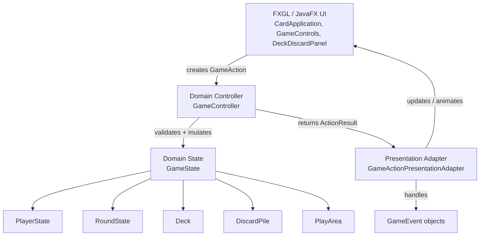
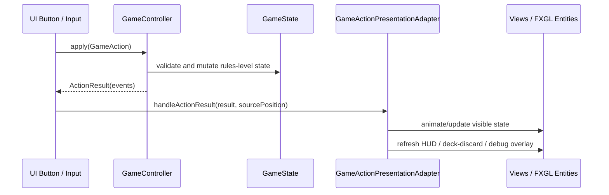

# Architecture Overview

Last updated: Milestone 5F follow-up

## Current Architectural Direction

La Kika is moving from a visual prototype toward a layered game architecture.

The current guiding rule is:

```text
GameState owns what is true.
Presentation owns how truth is shown.
GameController is the mutation boundary.
GameActionPresentationAdapter translates domain events into UI updates.
```

## Current Layers



## Current Action Pipeline



## Implemented Domain State

`GameState` currently owns:

- players
- deck
- discard pile
- play area
- round state

`PlayerState` currently owns:

- player id
- display name
- hand
- cumulative score
- castigos remaining
- opened status

`RoundState` currently owns:

- round number
- dealer
- active player
- turn phase

`PlayArea` currently owns:

- created melds as `MeldState`

## Implemented Actions

The action pipeline currently supports:

- `DrawFromDeckAction`
- `DiscardAction`
- `CreateMeldAction`

Current event types include:

- `CardDrawnEvent`
- `CardDiscardedEvent`
- `MeldCreatedEvent`
- `TurnPhaseChangedEvent`
- `ActivePlayerChangedEvent`

## Presentation Adapters and Transitional Views

`GameActionPresentationAdapter` is responsible for translating game events into presentation effects:

- drawing a card into the visible hand
- discarding a card to the discard pile
- animating a newly created meld
- switching the visible hand after active player changes
- refreshing the HUD, deck/discard panel, and debug hand overlay

`Hand` is still transitional. It currently mixes several responsibilities:

- visible hand rendering
- card entity registry
- selection state
- some animation behavior
- visual meld cache

Long-term, `Hand` should probably split into smaller roles such as:

```text
HandView
HandController
CardEntityRegistry
SelectionModel
PlayedMeldView
```

## Debug Tools

The debug hand overlay is strictly development-only.

Current state:

- It now reads real hands from `GameState`.
- It no longer uses `MockHandFactory`.
- It refreshes after successful game actions.
- It intentionally violates hot-seat privacy and must not become a normal gameplay feature.

Future player-facing privacy should use a pass-device screen:

```text
turn ends
→ hide hands
→ ask next player to confirm readiness
→ reveal next active player's hand
```

## Important Boundaries

### Domain must not know presentation

Domain classes should not know about:

- FXGL entities
- JavaFX nodes
- animation
- screen coordinates
- textures
- mouse input

### Presentation must not own rules

Presentation classes should not decide:

- whose turn it is
- whether an action is legal
- what cards are in a player's rules-level hand
- what melds exist in the rules-level play area

## Current Technical Debt

Known transitional areas:

- `CardApplication` still creates actions directly.
- `Hand` is still too broad.
- Failed actions still print to console.
- Castigo remains prototype-only.
- Opening requirements are not enforced.
- Full-table view still uses mock melds instead of real `PlayArea`.
- Debug controls are mixed into regular controls.


### ARCH-08: Hand Order as Game State

Hand order is now a rules-level/persistent player preference, not only a visual arrangement.

Current model:

```text
PlayerState.hand
= current rules-level hand order

PlayerState.customOrderCardIds
= saved custom order
```

Current hand-order actions:

- `SortHandByRankAction`
- `SortHandBySuitAction`
- `ReorderHandAction`
- `SaveCustomHandOrderAction`
- `RestoreCustomHandOrderAction`

Current behavior:

```text
Rank / Suit
→ changes current hand order only

Drag reorder
→ changes current hand order

Order click
→ restores saved custom order

Order click-and-hold
→ saves current hand order as custom order
```

The original dealt order becomes the first saved custom order.

Design rule:

```text
Visible hand order and debug hand overlay order should both derive from GameState.
```

### Planned Debug Drawer

Debug tools should not remain in the normal gameplay control row.

Planned hybrid approach:

```text
Debug drawer = compact access point for development tools
Debug overlays = large/full-screen inspection views
```

The drawer should eventually contain:

- Table View
- Debug Hands
- +Kind
- +Run
- Stress
- Clear
- future debug toggles


## Milestone 5G Follow-Up Notes

Hand ordering is now controller-driven but drag interaction remains presentation-driven during the gesture.

Important distinction:

```text
During drag:
    Hand updates visual ordering locally for smooth feedback.

On mouse release:
    Hand commits the final card order through ReorderHandAction.
```

This prevents GameState/event refreshes from fighting the drag animation.

Custom-order save feedback is implemented through `CardWiggleComponent` so it does not conflict with the existing hover/idle wiggle ownership.

Milestone mapping was clarified:

```text
5G = Hand Order State and Custom Ordering
5H = Debug Drawer Cleanup
5I = Hot-Seat Visual Privacy
5J = Save-Ready Snapshots
```

## Drag Anchor Note

Card dragging now uses a center-relative grab offset.

Reason:

```text
Cards visually scale/rotate around their center.
Dragging previously used a top-left offset.
Hover scale resets at drag start.
Top-left offset could therefore feel stale and cause drift.
```

The corrected model is:

```text
grabOffset = mousePosition - cardCenter
entityPosition = mousePosition - renderedCardCenter - grabOffset
```

This keeps the visual grab point stable even when hover-scale effects are disabled for dragging.


## Milestone 5H Debug Drawer

Debug tools have been moved out of the main control row.

Current structure:

```text
Main controls:
    Play Hand
    Discard
    Rank
    Suit
    Order
    Debug

Debug drawer:
    Table
    Hands
    +Kind
    +Run
    Stress
    Clear
```

Design reason:

```text
Gameplay controls should reflect real player actions.
Debug controls should remain available but visually separate.
```

The implementation is a hybrid:

```text
Debug drawer = compact access point
Debug overlays = full-screen inspection views
```

## Milestone 5H Polish

`Order` button confirmation now communicates only one thing:

```text
click-and-hold Order
→ save current custom order
→ animate button
```

A simple click restores the saved order but does not animate the button.

`DebugDrawer` now uses absolute screen-edge translation:

```text
closed X = sceneWidth
open X = sceneWidth - DRAWER_WIDTH
```

This makes the drawer slide in from the right edge instead of appearing abruptly.


## Milestone 5I Hot-Seat Privacy

Hot-seat privacy is now represented by a pass-device overlay.

Current flow:

```text
DiscardAction succeeds
→ GameController emits ActivePlayerChangedEvent
→ GameActionPresentationAdapter waits for discard animation
→ visible hand is cleared
→ PassDeviceOverlay appears
→ next player presses READY
→ next active player's hand renders
```

Design boundary:

```text
GameController owns active-player state.
PassDeviceOverlay owns player-facing privacy transition.
DebugHandOverlay remains development-only and must not be used as gameplay privacy UI.
```


## Milestone 5I.1 Active-Player Play Area Perspective

The played-meld display now follows the active player.

Current perspective model:

```text
perspective player = current active player
visible opponent = next player after active player
```

Rendering rule:

```text
perspective player's melds → current-player meld area
visible opponent's melds → opponent meld area
all other opponent melds → hidden until carousel controls exist
```

This keeps presentation perspective separate from turn rules. Milestone 6 can focus on action legality without also fixing whose melds are shown.

## Entity Registry Ownership Note

`CardEntityRegistry` currently stores both visible hand card entities and played meld card entities.

Important rule:

```text
Clearing the visible hand must remove only hand card entities.
It must not clear the entire registry.
```

Reason:

```text
Played meld entities persist across turns.
Perspective rendering needs the registry to find, hide, and reflow those entities.
```

This is another sign that `Hand` is transitional and should eventually split into separate views/controllers:

```text
HandView
PlayedMeldView
CardEntityRegistry or separate registries per view
```


## Milestone 5J Save-Ready Snapshots

The domain model now has a plain-data snapshot graph.

Current snapshot flow:

```text
GameState
→ GameStateSnapshot
→ GameState
```

Supported domain snapshots:

```text
GameStateSnapshot
PlayerStateSnapshot
RoundStateSnapshot
DeckSnapshot
DiscardPileSnapshot
PlayAreaSnapshot
MeldStateSnapshot
CardSnapshot
```

Design boundary:

```text
Snapshots are domain data.
Snapshots must not contain FXGL entities, JavaFX nodes, layout coordinates, or animation state.
```

This prepares for future work:

```text
JSON save files
save/load UI
replay/testing
eventual network synchronization
```

Milestone 5J intentionally does not implement persistence. It proves that the live domain state can become plain data and be reconstructed.


## Milestone 6A Turn Rules Foundation

Turn legality now has an explicit foundation.

New elements:

```text
ActionFailureCode
ActionResult.failureCode()
TurnRules
```

Current simple turn skeleton:

```text
DRAW_OR_CASTIGO
→ DrawFromDeckAction
→ MELD
→ CreateMeldAction zero or more times
→ DiscardAction
→ next player's DRAW_OR_CASTIGO
```

Design boundary:

```text
GameController applies actions.
TurnRules answers shared legality questions.
ActionResult carries success/failure plus events.
Presentation reports failures but does not decide legality.
```

This prepares Milestone 6B and later slices to add more complex rules without burying all checks directly inside action methods.


## Milestone 6B Opening Requirements

Opening requirements are now rules-level objects.

Current flow:

```text
CreateMeldAction
→ validate turn phase
→ validate meld structure
→ if player is closed, validate meld against OpeningRequirement
→ add MeldState to PlayArea
→ if player's created melds satisfy OpeningRequirement, mark opened
→ emit PlayerOpenedEvent
```

Important design choice:

```text
Multi-meld openings can be built one meld at a time.
```

Reason:

```text
The current UI creates one meld per CreateMeldAction.
Round 2 and Round 4 require two opening melds.
```

Closed players are restricted to opening-contributing melds until opened. After opening, they may freely create valid melds during the same turn.


## Milestone 6C Active-Player Castigo

Castigo now has a first rules-level action.

Current flow:

```text
TakeCastigoAction
→ require active player
→ require DRAW_OR_CASTIGO phase
→ require discard pile is not empty
→ require player has castigos remaining
→ consume one castigo
→ remove top discard card
→ draw four deck cards
→ add five total cards to player hand
→ advance phase to MELD
→ emit CastigoTakenEvent
```

Design boundary:

```text
6C implements active-player castigo only.
6D will implement out-of-turn castigo windows and timers.
```

Current prototype assumption:

```text
active-player castigo = 5 total cards
discard top card + 4 deck cards

future out-of-turn castigo = 4 total cards
discard top card + 3 deck cards
```

## Castigo House Rule Counts

Current default constants:

```text
ACTIVE_CASTIGO_DECK_CARDS = 4
OUT_OF_TURN_CASTIGO_DECK_CARDS = 3
```

These are intentionally explicit constants instead of implicit totals.

Reason:

```text
The discard top card is always part of castigo.
The house-rule variation concerns how many additional deck cards are drawn.
```

Future settings work should move these into configurable house-rule state.


## Milestone 6C.1 Real Play-Area Views and Opponent Carousel

The full-table view now reads real `GameState.playArea()` data instead of mock melds.

Current full-table flow:

```text
FullPlayAreaView
→ GameController.state()
→ GameState.playArea()
→ PlayArea.meldsCreatedBy(playerId)
→ read-only card views
```

The opponent meld area now has carousel controls:

```text
< previous opponent
> next opponent
```

Manual carousel cycling uses horizontal slide animation.

Important dependency for future meld mutation:

```text
Opponent carousel
→ choose which opponent's melds are visible
→ later select a specific MeldState
→ later mutate meld / steal joker
```

Current limitation:

```text
VisualMeldStore is still the interactive played-meld presentation cache.
Full-table view reads real PlayArea directly.
A later milestone should converge these views around real MeldState identity.
```


## Milestone 6D Castigo Decision Flow

The deck/discard HUD now separates piles from decisions.

Before:

```text
deck card carried DRAW overlay
discard card carried CASTIGO overlay
```

After:

```text
deck pile
discard pile
dedicated Draw / Castigo controls below
```

Active-player flow:

```text
DRAW_OR_CASTIGO
→ active player chooses Draw or Castigo
→ Draw means decline castigo and draw one deck card
→ after Draw, out-of-turn castigo offers begin
→ Castigo means take discard top + 4 deck cards
```

Out-of-turn flow:

```text
active player has drawn
→ active hand hidden
→ next eligible player gets hot-seat privacy screen
→ Take Castigo or Pass
→ timer expiration is Pass
→ first player to accept gets discard top + 3 deck cards
→ device returns to active player
```

Current implementation boundary:

```text
GameController owns card transfer and castigo counts.
CardApplication coordinates the hot-seat offer sequence.
PassDeviceOverlay owns privacy-screen decision UI.
DeckDiscardPanel owns active-player decision controls.
```

Future cleanup should promote the pending castigo offer sequence into explicit domain state.

## Follow-up: Castigo Window Promotion Plan

Milestone 6D intentionally left castigo-offer sequencing in `CardApplication`.

Next architectural step:

```text
Milestone 6D.1
→ add explicit castigo window domain state
→ move current decision player / eligible players / declined players into GameState or a child value object
→ make PassCastigoAction rules-level
```

This should happen before save/load, replay, scoring edge cases, or networked play depend on castigo state.

## Follow-up: Straight Flush Joker Search

The straight-flush validator now continues searching after an invalid consecutive-joker assignment.

This preserves the rule:

```text
jokers cannot be consecutive in the chosen straight flush interpretation
```

without incorrectly rejecting a hand that has another legal interpretation.
