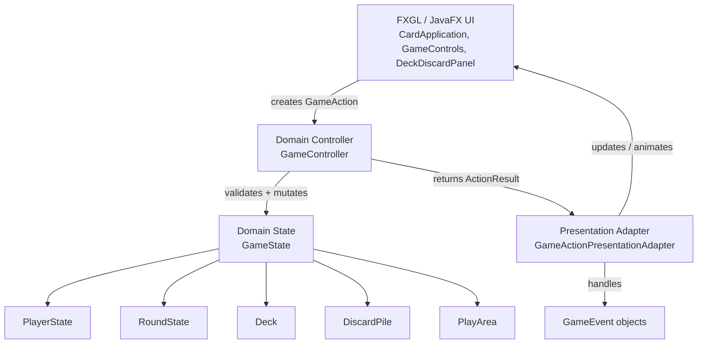
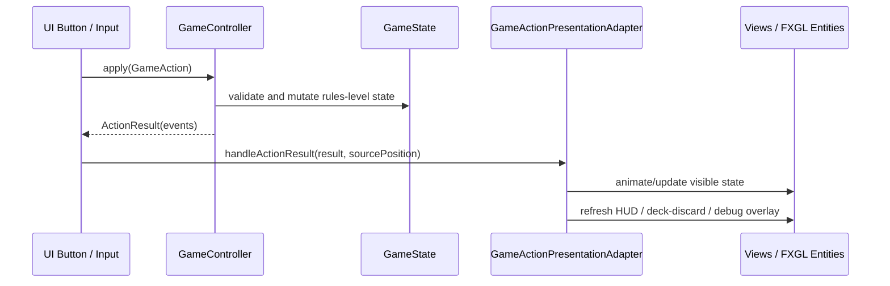

# Architecture Overview

Last updated: Milestone 5F follow-up

## Current Architectural Direction

La Kika is moving from a visual prototype toward a layered game architecture.

The current guiding rule is:

```text
GameState owns what is true.
Presentation owns how truth is shown.
GameController is the mutation boundary.
GameActionPresentationAdapter translates domain events into UI updates.
```

## Current Layers



## Current Action Pipeline



## Implemented Domain State

`GameState` currently owns:

- players
- deck
- discard pile
- play area
- round state

`PlayerState` currently owns:

- player id
- display name
- hand
- cumulative score
- castigos remaining
- opened status

`RoundState` currently owns:

- round number
- dealer
- active player
- turn phase

`PlayArea` currently owns:

- created melds as `MeldState`

## Implemented Actions

The action pipeline currently supports:

- `DrawFromDeckAction`
- `DiscardAction`
- `CreateMeldAction`

Current event types include:

- `CardDrawnEvent`
- `CardDiscardedEvent`
- `MeldCreatedEvent`
- `TurnPhaseChangedEvent`
- `ActivePlayerChangedEvent`

## Presentation Adapters and Transitional Views

`GameActionPresentationAdapter` is responsible for translating game events into presentation effects:

- drawing a card into the visible hand
- discarding a card to the discard pile
- animating a newly created meld
- switching the visible hand after active player changes
- refreshing the HUD, deck/discard panel, and debug hand overlay

`Hand` is still transitional. It currently mixes several responsibilities:

- visible hand rendering
- card entity registry
- selection state
- some animation behavior
- visual meld cache

Long-term, `Hand` should probably split into smaller roles such as:

```text
HandView
HandController
CardEntityRegistry
SelectionModel
PlayedMeldView
```

## Debug Tools

The debug hand overlay is strictly development-only.

Current state:

- It now reads real hands from `GameState`.
- It no longer uses `MockHandFactory`.
- It refreshes after successful game actions.
- It intentionally violates hot-seat privacy and must not become a normal gameplay feature.

Future player-facing privacy should use a pass-device screen:

```text
turn ends
→ hide hands
→ ask next player to confirm readiness
→ reveal next active player's hand
```

## Important Boundaries

### Domain must not know presentation

Domain classes should not know about:

- FXGL entities
- JavaFX nodes
- animation
- screen coordinates
- textures
- mouse input

### Presentation must not own rules

Presentation classes should not decide:

- whose turn it is
- whether an action is legal
- what cards are in a player's rules-level hand
- what melds exist in the rules-level play area

## Current Technical Debt

Known transitional areas:

- `CardApplication` still creates actions directly.
- `Hand` is still too broad.
- Failed actions still print to console.
- Castigo remains prototype-only.
- Opening requirements are not enforced.
- Full-table view still uses mock melds instead of real `PlayArea`.
- Debug controls are mixed into regular controls.
