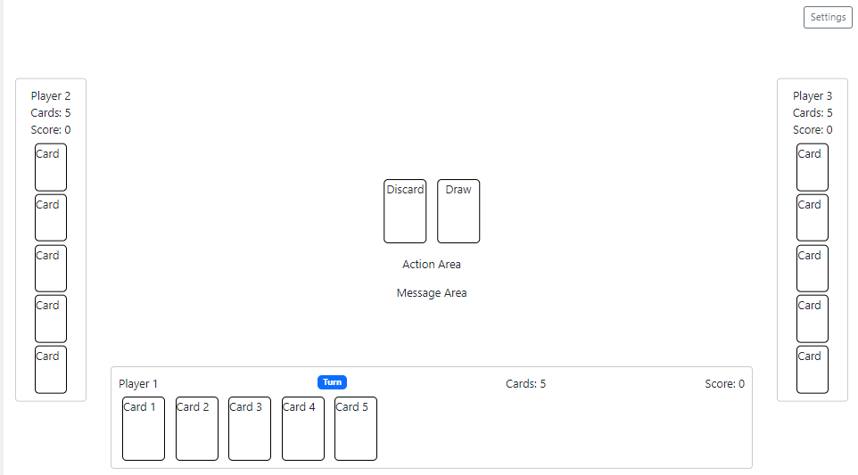
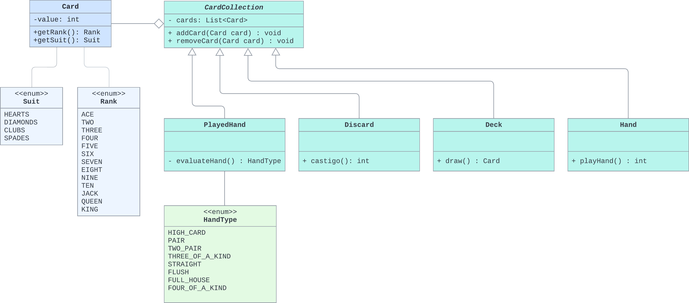

# La Kika
La Kika is a family game (2+ players) that is played over several rounds. The first player to play all the cards in their hands ends the round and the other players accumulate points for the cards left in their hand. The player with the least points at the end of the game wins!

# Wireframe
The game consists of a deck, player's hand, played cards, and discard pile.

# UML
The game model consists mainly of the following concrete classes: Card, Hand, Deck, Discard, Played, and Player. Note that many of these classes are collections of Card objects, so there is a CardCollection abstract class. Also, there are several enumerations to categorize a card's rank and suit, as well as an enumeration to handle the ranking and categorization of hands.

# Demo
In this demo you will se me select up to five cards and play them.

